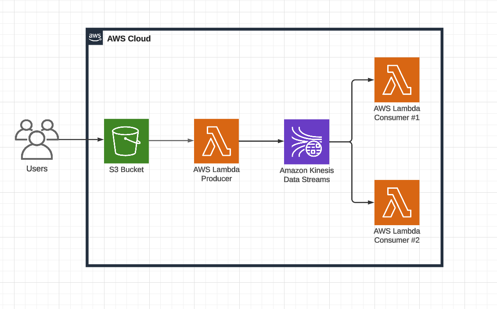

# Realtime Data Streaming App on AWS

This is a realtime data streaming app - a mini project to demonstrate how producers, consumers and streaming services interact in a real world setting to produce, stream and consume data.

```
Please don't forget to ⭐ this repo if you found it helful. Means a lot!
```

## Architecture

Design: https://tinyurl.com/mpt9yj3u



## Tech Stack

- Python
- Amazon Web Services
    - AWS Lambda
    - AWS S3 Bucket
    - AWS Kinesis Data Stream
## Deployment

1. Create an S3 bucket.
2. Create a Kinesis Stream. This stream will transfer data from producer to consumer lambda functions.
3. Create a lambda function ```producer``` and copy code from ```producer.py``` file into this function. Attach s3 bucket created in step 1 as a trigger to this lambda function. So, whenever a file is uploaded to s3 bucket, lambda wil get triggered. It will then pull the file, read the content and push it to Kinesis stream.
4. Create two consumer functions ```Consumer1``` and ```Consumer 2``` and copy code from ```consumer_1.py``` and ```consumer_2.py``` into these functions. Attach Kinesis stream as a trigger to both functions so that whenever data comes into the stream, the consumers can consume data and perform there respective roles.


## Use Cases:

Realtime data streaming design is has many use cases. Some of them are:

1. *Real-time Analytics*: Process and analyze log and event data as it is generated to gain insights in near real-time.

2. *Data Lakes*: Ingest large streams of data into S3 for long-term storage and processing.

3. *Real-time Dashboards*: Power dashboards that need up-to-date information.

4. *Machine Learning*: Feed real-time data into machine learning models for live predictions or anomaly detection.
